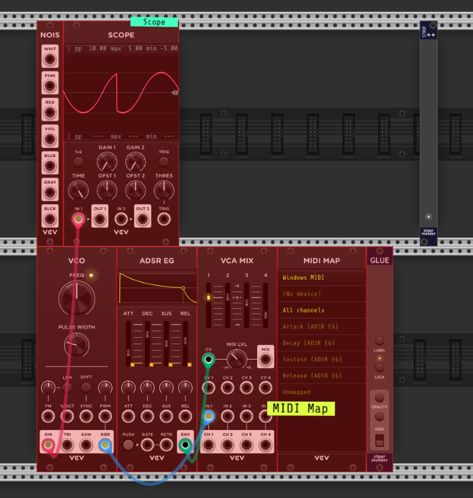

# stoermelder STRIP++

STRIP++ is an utility module for pasting and importing Rack selections while preserving parameter mappings and [GLUE](Glue.md) labels.

How it works:

- STRIP++ does not have to be present when saving the selection, it works with any .vcvs-file.
- To import a saved selection, first add STRIP++. Right-click on the module, select "Import" from the context menu and choose the .vcvs-file to be imported. An import can also be triggered by hotkey Ctrl+Shift+B.
- At first, the selection appears as a semi-transparent preview, until you move the mouse to where you want to place. The import is commited by left-click or can be aborted by right-click and escape key.
- It also works with a selection currently stored in the clipboard. It  can be added by context menu option or hotkey Ctrl+Shift+V.
- STRIP++ only functions as an import utility here, it can be deleted after completing the import.

### Changelog

- v2.0.0
    - Initial release of STRIP++